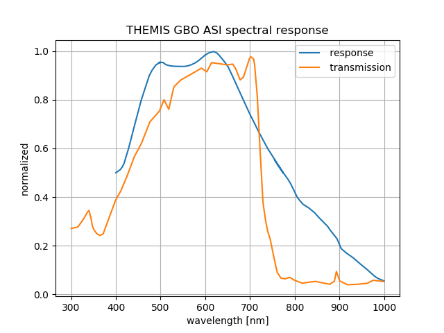

# THEMIS GBO ASI Reader

[](https://doi.org/10.5281/zenodo.215309)

[](https://pypi.python.org/pypi/themisasi)
[](http://pepy.tech/project/themisasi)


Read & plot 256x256 "high resolution" THEMIS ASI ground-based imager data from Python.
THEMIS ASI data are collected with the original 2002 design, using Starlight-Xpress Lodestar MX716 cameras with monochrome
[Sony ICX249AL imaging chips](http://www.astro.uu.se/grundutb/wt/images/ICX249ALpalstcamex.pdf).
A subregion from full-size 752 x 582 pixels (512 x 512 pixels) are 2x2 binned to 256 x 256 pixels and retrieved over USB 1.1 for disk storage.

This package also reads the THEMIS ASI star registered
[plate scale](http://data.phys.ucalgary.ca/sort_by_project/THEMIS/asi/skymaps/new_style/),
giving **azimuth and elevation** for each pixel.

## Install

```sh
git clone https://github.com/space-physics/themisasi

pip install -e themisasi
```

Optionally test the basic functionality by:

```sh
pytest themisasi
```

## Usage

One of the main ways analysts might use THEMIS-ASI data is by loading it into a 3-D array (time, x, y).

### Single time

This example is where the ASI video files are in `~/data/themis`, and the Gakona site is selected at the time shown.

```python
import themisasi as ta

dat = ta.load('~/data/themis', site='gako', treq='2011-01-06T17:00:03')
```
This returns the camera image from Gakona camera closest to the requested time, and the 'az', 'el' calibration data, if available.


THEMIS-ASI output
[xarray.Dataset](http://xarray.pydata.org/en/stable/generated/xarray.Dataset.html),
which is used throughout geosciences and astronomy.
Xarray may be thought of as a "smart" Numpy array, or a multidimensional Pandas array.
A THEMIS image data stack is obtained by:

```python
dat = ta.load(...)

imgs = dat['imgs']
```

* `dat.time` contains the approximate time of each image (consider the finite exposure time).
* `dat.x` and `dat.y` are simple pixel indices, perhaps not often needed.

### Image + Azimuth, Elevation

Loading calibration data gives azimuth, elevation for each pixel and lat, lon of each camera.
```python
import themisasi as ta

dat = ta.load('~/data/themis', site='gako', treq='2011-01-06T17:00:03')
```
If an appropriate calibration file exists, `dat` additionally contains 'az', 'el', 'lat', 'lon' and so on to allow using data for multi-camera analyses.

### Coordinate conversion (optional)

If desired, convert azimuth/elevation to ra/dec using
[pymap3d](https://github.com/geospace-code/pymap3d).

```sh
pip install pymap3d
```
and then from within Python:
```python
import pymap3d as pm

rasc, decl = pm.azel2radec(dat.az, dat.el, dat.lat, dat.lon, dat.time)
```

## Download, Read and Plot THEMIS ASI Data

The data is downloaded concurrently using `asyncio` and `aiohttp_requests`.
There is one concurrent worker launched per site, that downloads one time at a time concurrently across sites.
Thus if downloading for one site, one time downloads at a time.
If downloading for 5 sites, five files download at a time across requested times by site.

Get video data from Themis all-sky imager
[data repository](http://themis.ssl.berkeley.edu/data/themis/thg/l1/asi/).
The
[plate scale](http://themis.ssl.berkeley.edu/themisdata/thg/l2/asi/cal/)
data is also downloaded.
The calibration files are named `*asc*.cdf` or `*skymap*.sav`.

Example: February 4, 2012, 8 UT Gakona

```sh
python -m themisasi.download 2012-02-04T08 gako ~/data
```
or via the API:

```python
import themisasi as ta

ta.download('2012-02-04T08', 'gako', '~/data')
```
with the API, it is convenient to for-loop over many sites at the same time(s):

```python
sites = ['fykn', 'gako']

for site in sites:
   ta.download('2012-02-04T08', site, '~/data')
```


With the calibration data, verify that the time range of the calibration data is appropriate for the time range of the image data.
For example, calibration data from 1999 may not be valid for 2018 if the camera was ever moved in the enclosure during maintanence.https://github.com/dib-lab/khmer/pull/1430

You can optionally download from within Python:

```python
import themisasi as ta

ta.download('2012-03-12T12', 'fykn', '~/data')
```

### get times in a file

the convenience function `themisasi.io.filetimes(filename)` returns a list of Python `datetime` in a file

### Video Playback / PNG conversion

This example plays the video content.

Use the `-o` option to dump the frames to individual PNGs for easier back-and-forth viewing.
The calibration file (second filename) is optional.

```sh
python -m themisasi.video ~/data/themis/thg_l1_asf_fykn_2013041408_v01.cdf
```

### Plot time series of pixel(s)

Again, be sure the calibration file is appropriate for the time range of the video--the camera may have been moved / reoriented during maintenance.

The pixels can be specified by (azimuth, elevation) or (lat, lon, projection altitude [km])

Azimuth / Elevation:

```sh
python -m themisasi.pixels tests/thg_l1_ast_gako_20110505_v01.cdf -az 65 70 -el 48 68
```

Latitude, Longitude, Projection Altitude [kilometers]:
Typically the brightest aurora is in the 100-110 km altitude range, so a common approximate is to assume "all" of the brightness comes from a single altitude in this region.

```sh
python -m themisasi.pixels tests/thg_l1_ast_gako_20110505_v01.cdf -lla 65 -145 100.
```

## Notes

Themis site map (2009)

[](http://themis.ssl.berkeley.edu/gbo/display.py?)

THEMIS GBO ASI spectral response:



### Articles

These articles give vital descriptions of THEMIS GBO ASI.

* [Mende 2008 SSR](http://www.igpp.ucla.edu/public/THEMIS/SCI/Pubs/2008_Refereed/mende_ssr_onlinefirst.pdf)
* color instrument based on Themis: [Jackel 2014](http://eprints.lancs.ac.uk/68180/4/gi_3_71_2014.pdf)


### Resources

* Themis GBO ASI [site coordinates](http://themis.ssl.berkeley.edu/images/ASI/THEMIS_ASI_Station_List_Nov_2011.xls)
* THEMIS GBO ASI [plate scale](http://data.phys.ucalgary.ca/sort_by_project/THEMIS/asi/skymaps/new_style/)
* THEMIS GBO ASI [plate scale](http://themis.ssl.berkeley.edu/themisdata/thg/l2/asi/cal/)
* Themis GBO ASI [data repository](http://themis.ssl.berkeley.edu/data/themis/thg/l1/asi/)
* Themis GBO ASI [mosaic (all sites together)](http://themis.ssl.berkeley.edu/gbo/display.py?)


### data corruption

I discovered that IDL 8.0 had a problem saving structured arrays of bytes.
While current versions of IDL can read these corrupted .sav files, GDL 0.9.4 and SciPy 0.16.1 cannot.
My
[patch is part of SciPy](https://github.com/scipy/scipy/pull/5801)
to allow reading these files, which was incorporated into SciPy 0.18.0.

As a fallback, read and rewrite the corrupted file with the IDL script in the
[idl](idl/)
directory.
